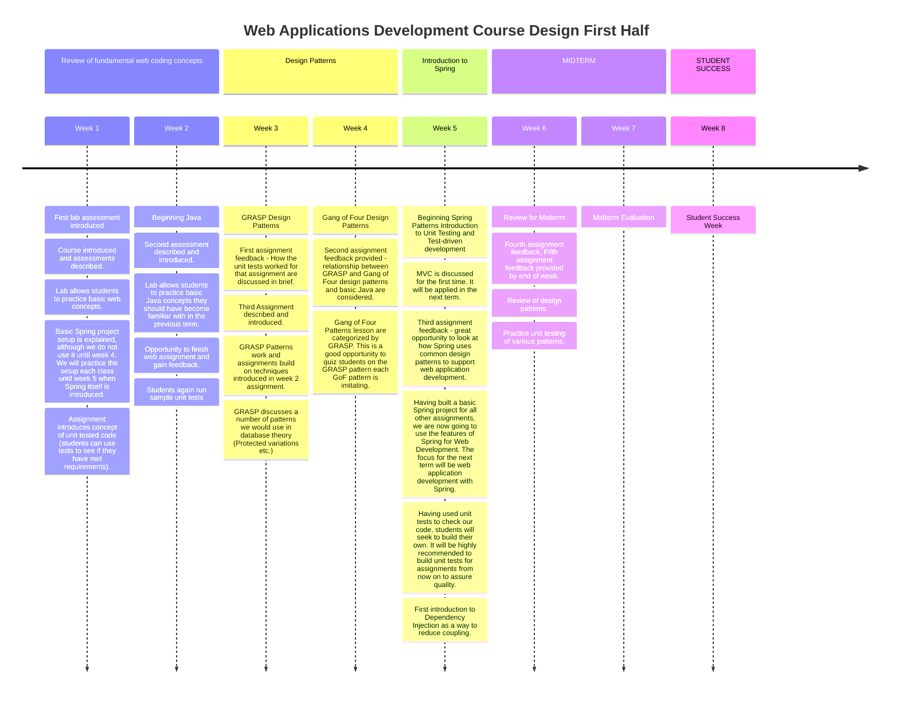
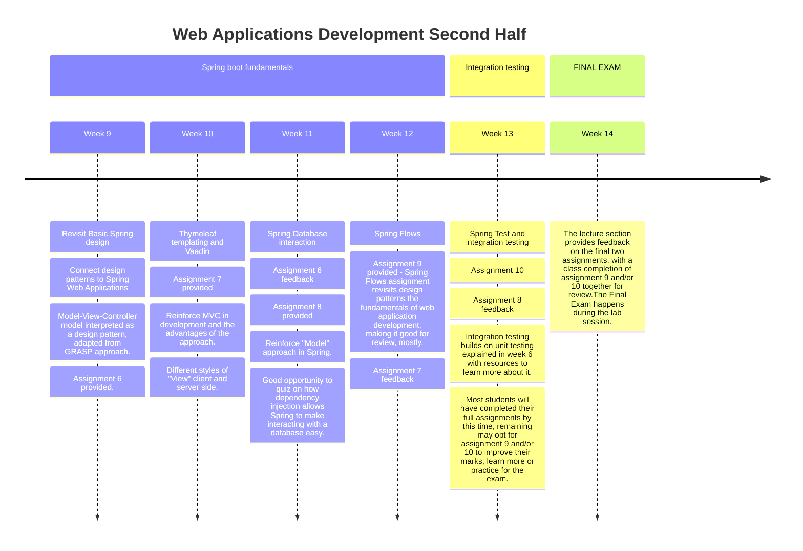

# Effective Feedback for Student Success Assignment

## Learning Outcomes

- Gather and document application requirements as a result of analysis of business requirements.
- Apply software design patterns and Model-View-Controller (MVC) as part of a Web solution.
- Develop Web applications using Spring Framework and a modern Integrated Development Environment (IDE).
- Apply database theory in the development of persistent data applications and display Web-based reports from Oracle Database.
- Test the quality of Web applications using integration and unit tests, and metrics.

### First Half

### Second half

